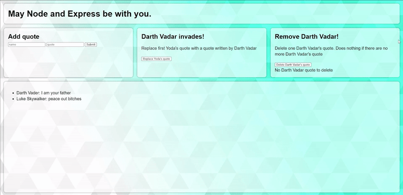

# [First CRUD App]
Type in a StarWars quote from your favourite characters and have it added to our StarWars database! If you're feeling mischievious, play with the available features... just don't get too tempted to join the dark side.....

  

## How It's Made:

**Tech used:** HTML, CSS, JavaScript, MongoDB, Express.js, Node.js

## Lessons Learned:

This was my first application that included back-end development, and it was my first time using Express and MongoDB. Also, I learned quote a few new tricks for using Node.js, such as using nodemon to automatically refresh the server when a file (used by server.js) is saved. The main focus of this project was learning about the CRUD operations and how they are used to create restful API's. This project was extremely helpful in becoming more familiar with other concepts as well, such as JS objects and JSON, promises, and Fetch API. 
